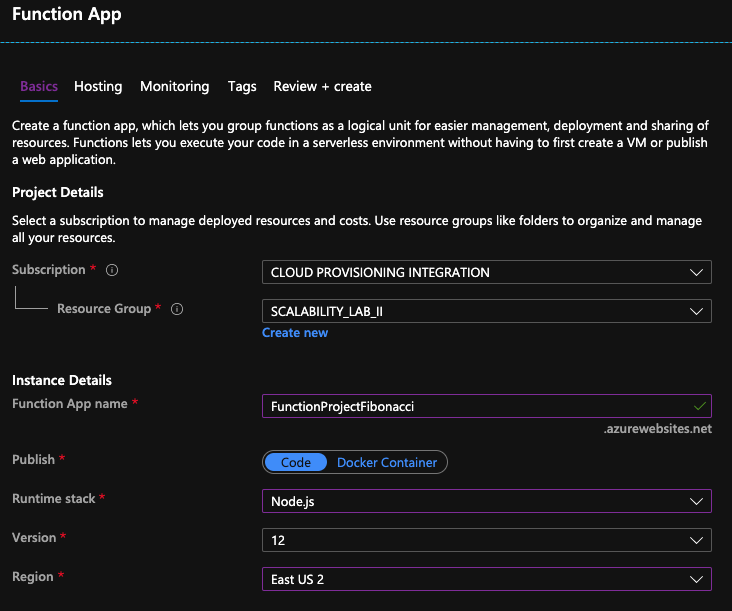
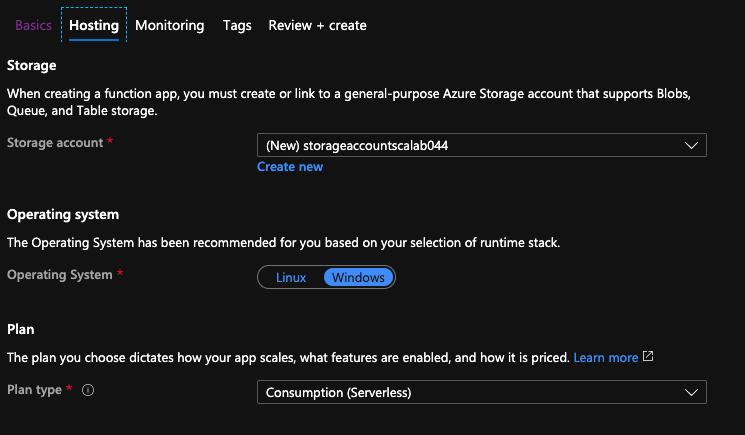
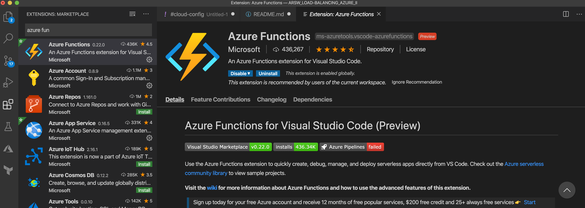
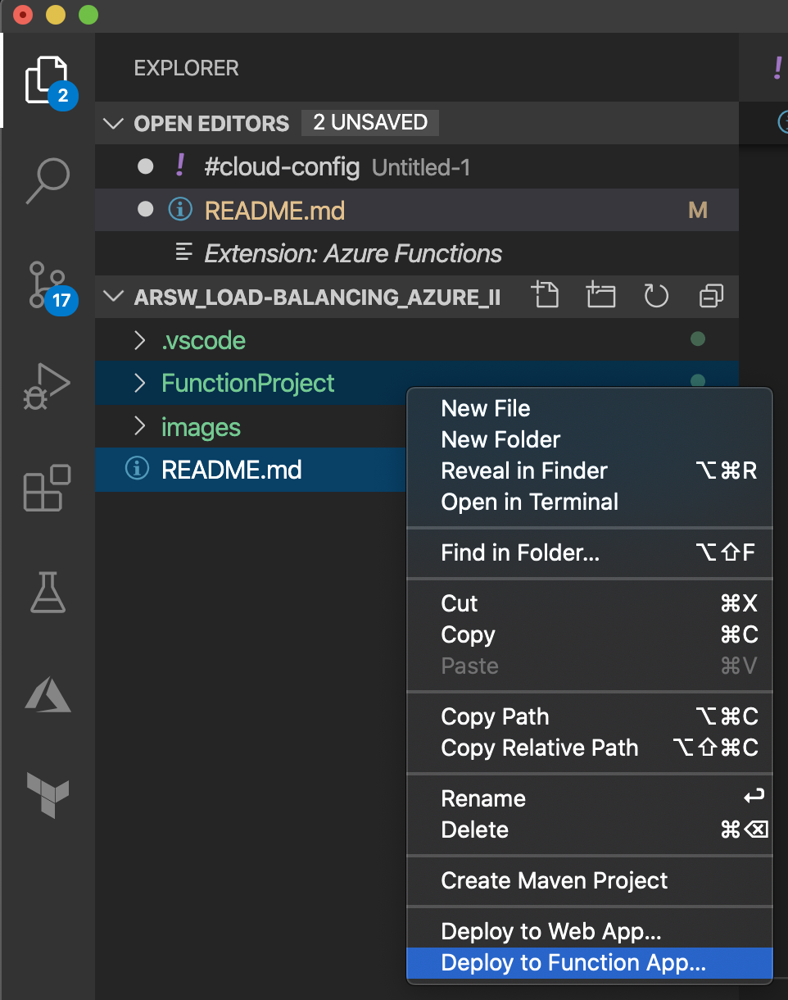
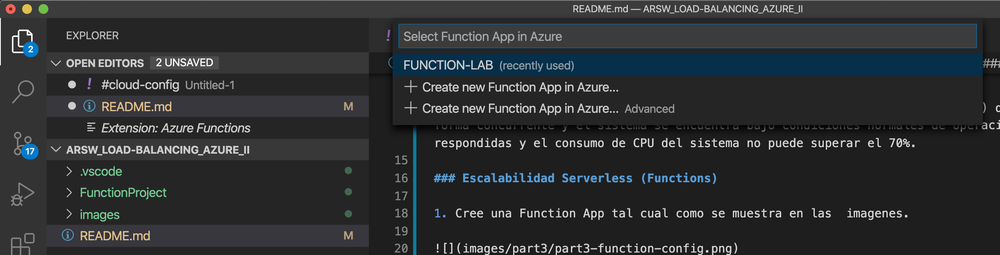
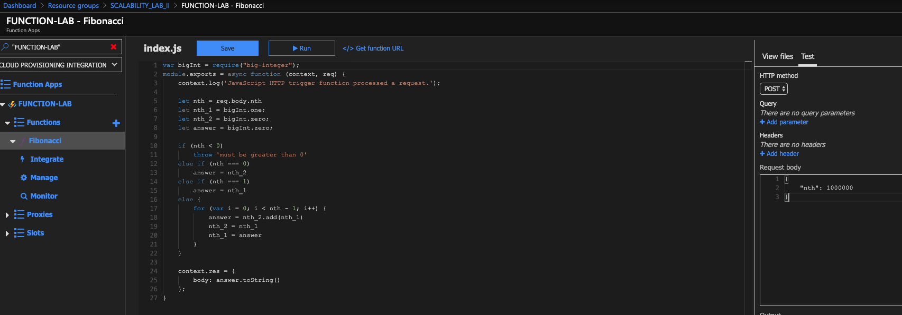

# 🎓 Escuela Colombiana de Ingeniería  
## 🏗️ Arquitecturas de Software - ARSW  

# 🚀 Escalamiento en Azure con Máquinas Virtuales, Scale Sets y Service Plans

---

## 👨‍💻 Developers

- 👨‍💻 **Juan Pablo Caballero**
- 👨‍💻 **Robinson Steven Nuñez**

---

## 📌 Dependencias

- Cree una cuenta gratuita en Azure. Puede guiarse con esta [documentación](https://azure.microsoft.com/es-es/free/students/).  
  Al hacerlo, contará con **$100 USD** para gastar durante **12 meses**.

- Antes de iniciar con el laboratorio, revise la siguiente documentación sobre [Azure Functions](https://www.c-sharpcorner.com/article/an-overview-of-azure-functions/).

---

## 📖 Parte 0 - Entendiendo el escenario de calidad

Adjunto a este laboratorio encontrará una aplicación totalmente desarrollada que tiene como objetivo calcular el **enésimo valor de la secuencia de Fibonacci**.

### ⚙️ Escalabilidad

Cuando un conjunto de usuarios consulta un enésimo número de la secuencia de Fibonacci **superior a 1.000.000** de forma concurrente y el sistema se encuentra bajo condiciones normales de operación, todas las peticiones deben ser respondidas y el consumo de CPU del sistema **no puede superar el 70%**.

---

## ☁️ Escalabilidad Serverless (Functions)

### 1️⃣ Crear la Function App
Cree una **Function App** tal como se muestra en las imágenes.

  

---

### 2️⃣ Instalar la extensión de Azure Functions
Instale la extensión de **Azure Functions** para **Visual Studio Code**.

---

### 3️⃣ Desplegar la Function a Azure
Despliegue la Function de Fibonacci a Azure usando **Visual Studio Code**.  
La primera vez que lo haga, se le pedirá autenticarse; siga las instrucciones.

  

---

### 4️⃣ Probar la Function
Diríjase al portal de Azure y pruebe la Function.

---

### 5️⃣ Modificar la colección de Postman con Newman
Modifique la colección de **Postman** con **Newman** de tal forma que pueda enviar **10 peticiones concurrentes**.  
Verifique los resultados y presente un informe.

---

### 6️⃣ Crear una nueva Function con memoization
Cree una nueva Function que resuelva el problema de Fibonacci, pero esta vez utilizando un enfoque **recursivo con memoization**.

Pruebe la función varias veces, luego no haga nada durante al menos **5 minutos**.  
Después, pruebe la función nuevamente con los valores anteriores.

**¿Cuál es el comportamiento?**

---

## ❓ Preguntas

- ¿Qué es un Azure Function?
- ¿Qué es serverless?
- ¿Qué es el runtime y qué implica seleccionarlo al momento de crear el Function App?
- ¿Por qué es necesario crear un Storage Account junto con un Function App?
- ¿Cuáles son los tipos de planes para un Function App?  
  ¿En qué se diferencian? Mencione ventajas y desventajas de cada uno.
- ¿Por qué la memoization falla o no funciona correctamente?
- ¿Cómo funciona el sistema de facturación de las Function App?
- Informe

---

## 📄 Solución Parte 1 a 6 y Preguntas

👉 [**Ver el Desarrollo de la parte 1 a 6 y las Respuestas a las Preguntas**](docs/Parte1-LAB10.pdf)

---